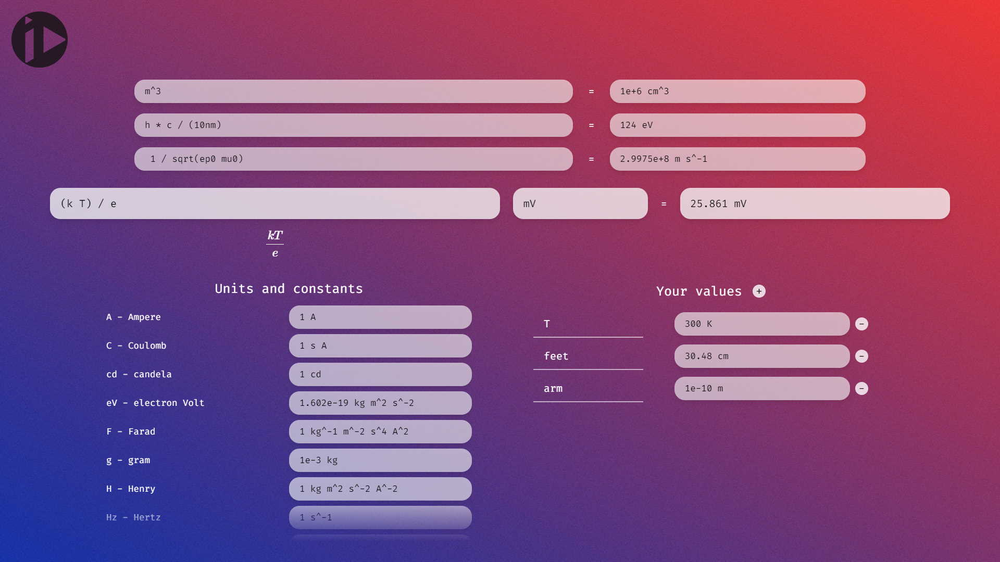

# Unity calculator

### Online calculator with support for units, constants and custom values.

### [Visit page](zokalyx.github.io/unity)

# Instructions

- Type your formula in the formula box and optionally add the units you want the result to be expressed in.

- Save your calculation by pressing enter and add custom constants or values in the bottom right section.

- You can see the full list of available values in [this file](database.json) if you can't find a specific one.

# Warnings

- The formula visualization works independently of the evaluation engine. This means that on rare occasions, the preview and the result might correspond to different formulas. To be safe, **always use brackets when necessary**.

# Notes

- There is no support for mobile at the moment.
- All available units are SI derived for now.
- The parsing and evaluation engine was made specifically for this project and is not well tested.
- Formula preview uses MathJax 2 with the AsciiMath configuration.
- Built with SvelteKit.
